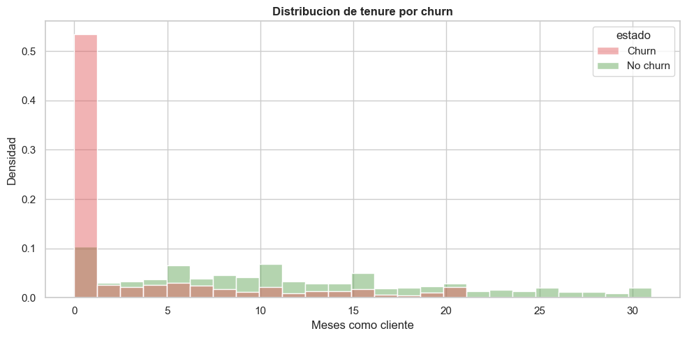
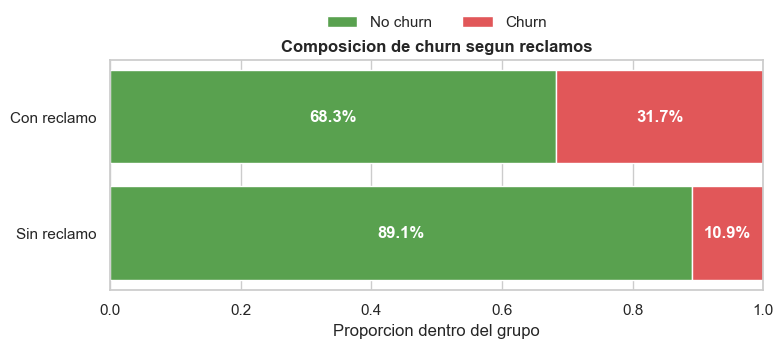
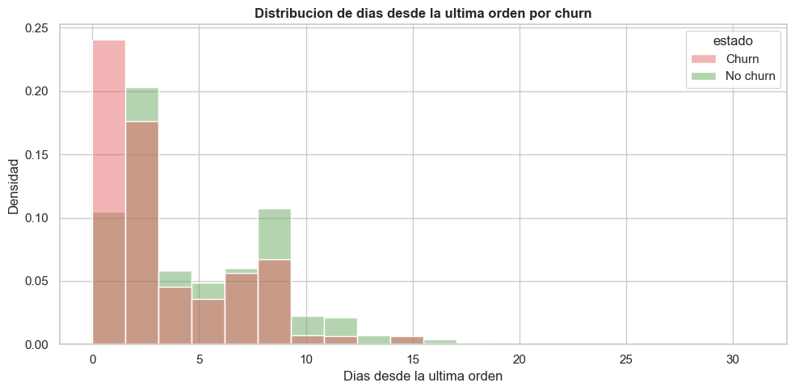
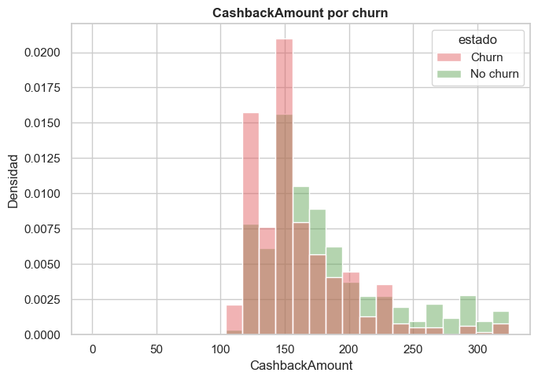
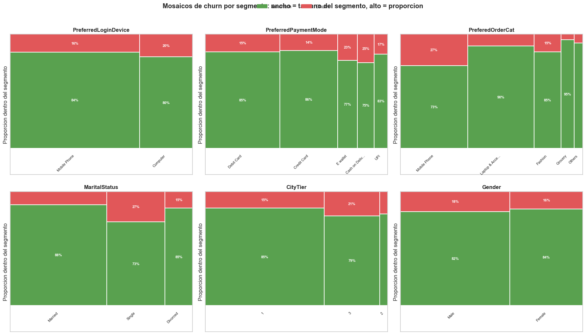

# Hipotesis de Negocio - Churn de Clientes

**Dataset:** E-commerce Customer Churn  
**Fecha:** 11/06/2026  
**Objetivo:** identificar patrones asociados al abandono que puedan convertirse en alertas y acciones de retencion.

## Criterio de analisis

Las hipotesis se formularon antes del modelado y se validaron con evidencia visual y estadistica. Para variables numericas se uso Mann-Whitney U, porque no se asumio normalidad. Para variables categoricas se uso chi-cuadrado. Ademas del p-valor se reporta tamano de efecto, ya que una diferencia puede ser estadisticamente significativa sin ser comercialmente importante.

Los resultados muestran asociacion, no causalidad. Una variable asociada al churn puede ayudar a priorizar clientes, pero no demuestra por si sola que modificarla reduzca el abandono.

**Aclaracion sobre la cantidad de casos:** el dataset original contiene 5.630 clientes y no fue modificado. Para evitar que valores extremos distorsionen algunos graficos y comparaciones del EDA, se excluyeron solamente de esta base analitica siete observaciones puntuales: dos extremos de `WarehouseToHome`, cuatro de `Tenure` y el maximo de `DaySinceLastOrder`. Por eso las tablas de hipotesis suman 5.623 clientes. Estas exclusiones visuales no implican que las filas deban eliminarse del futuro entrenamiento del modelo.

---

## H1 - Los clientes nuevos tienen mayor riesgo de churn

**Enunciado:** los clientes con menor antiguedad tienen mayor riesgo de abandonar porque todavia no desarrollaron habito, confianza ni costo de cambio.

**Variable analizada:** `Tenure`  
**Tipo:** numerica  
**Target:** `Churn`

**Test aplicado:** Mann-Whitney U.

| Grupo | Clientes | Media | Mediana |
|---|---:|---:|---:|
| Sigue activo | 4.676 | 11,25 meses | 10 meses |
| Se fue | 947 | 3,57 meses | 1 mes |

**Resultado:** p-valor < 0,001; rank-biserial = 0,608, efecto alto.

**Interpretacion de negocio:** la antiguedad es la senal mas fuerte del EDA. El riesgo se concentra durante los primeros meses, cuando la relacion con la empresa todavia es debil.

**Recomendacion:** priorizar onboarding, seguimiento temprano y pruebas de beneficios iniciales. La efectividad de estas acciones debe validarse con un piloto o experimento.

---

## H2 - Los clientes que hicieron reclamos churnean mas

**Enunciado:** un reclamo puede reflejar una mala experiencia y anticipar el abandono.

**Variable analizada:** `Complain`  
**Tipo:** binaria  
**Target:** `Churn`

**Test aplicado:** chi-cuadrado de independencia.

| Reclamo | Clientes | Tasa de churn |
|---|---:|---:|
| Sin reclamo | 4.021 | 10,92% |
| Con reclamo | 1.602 | 31,71% |

**Resultado:** chi-cuadrado = 352,157; p-valor < 0,001; Cramer's V = 0,250, efecto medio.

**Interpretacion de negocio:** la tasa de churn de quienes reclamaron es aproximadamente tres veces la de quienes no reclamaron. Es una senal clara para customer experience y retencion.

**Recomendacion:** evaluar un flujo de recuperacion posterior al reclamo. Antes de usar la variable en el modelo debe confirmarse que el reclamo fue registrado antes del abandono; de lo contrario, existiria leakage temporal.

---

## H3 - Mas dias desde la ultima orden anticipan churn

**Enunciado:** se esperaba que una mayor cantidad de dias sin comprar indicara inactividad y mayor riesgo de abandono.

**Variable analizada:** `DaySinceLastOrder`  
**Tipo:** numerica  
**Target:** `Churn`

**Test aplicado:** Mann-Whitney U.

| Grupo | Clientes | Media | Mediana |
|---|---:|---:|---:|
| Sigue activo | 4.676 | 4,86 dias | 4 dias |
| Se fue | 947 | 3,37 dias | 2 dias |

**Resultado:** p-valor < 0,001; rank-biserial = 0,270, efecto medio.

**Interpretacion de negocio:** la evidencia contradice la hipotesis inicial. En esta base, quienes churnearon tienen menos dias desde su ultima compra. Esto puede deberse a la definicion de churn o al momento en que se midio la variable.

**Recomendacion:** no usar esta variable como argumento ejecutivo ni regla de campana hasta confirmar su ventana temporal. En modelado conviene comparar escenarios con y sin ella.

---

## H4 - Menor cashback o menor actividad se asocian a mayor churn

**Enunciado:** clientes con menos beneficios o una relacion transaccional mas debil podrian tener menos incentivos para permanecer.

**Variables analizadas:** `CashbackAmount`, `OrderCount` y `CouponUsed`  
**Tipo:** numericas  
**Target:** `Churn`

**Test aplicado:** Mann-Whitney U para cada variable.

| Variable | Media activos | Media churn | p-valor | Rank-biserial | Lectura |
|---|---:|---:|---:|---:|---|
| `CashbackAmount` | 180,61 | 160,32 | < 0,001 | 0,267 | Efecto medio |
| `OrderCount` | 3,10 | 2,88 | 0,009 | 0,052 | Efecto bajo |
| `CouponUsed` | 1,72 | 1,71 | 0,512 | 0,013 | Sin diferencia relevante |

**Interpretacion de negocio:** cashback presenta una asociacion relevante con permanencia. La cantidad de ordenes separa poco a los grupos y el uso de cupones no muestra una diferencia util.

**Recomendacion:** evaluar cashback como palanca mediante un piloto sobre clientes de riesgo. No se recomienda una campana masiva: recibir cashback tambien puede ser consecuencia de comprar mas, por lo que la relacion observada no demuestra causalidad.

---

## H5 - Algunos segmentos presentan mayor churn

**Enunciado:** el abandono no se distribuye igual entre categorias, medios de pago y perfiles de cliente.

**Variables analizadas:** `PreferredLoginDevice`, `PreferredPaymentMode`, `PreferedOrderCat`, `MaritalStatus`, `CityTier` y `Gender`  
**Tipo:** categoricas  
**Target:** `Churn`

**Test aplicado:** chi-cuadrado de independencia para cada variable.

| Variable | Segmento con mayor churn | Tasa | Cramer's V | Efecto |
|---|---|---:|---:|---|
| `PreferedOrderCat` | Mobile Phone | 27,43% | 0,227 | Medio |
| `MaritalStatus` | Single | 26,73% | 0,183 | Medio |
| `PreferredPaymentMode` | Cash on Delivery | 24,90% | 0,096 | Bajo |
| `CityTier` | Tier 3 | 21,37% | 0,085 | Bajo |
| `PreferredLoginDevice` | Computer | 19,85% | 0,051 | Bajo |
| `Gender` | Male | 17,73% | 0,029 | Bajo |

Todos los tests resultaron significativos al 5%, pero los tamanos de efecto muestran que no todas las diferencias tienen la misma importancia comercial.

**Interpretacion de negocio:** categoria de compra y estado civil separan mas que genero, dispositivo o ciudad. Sin embargo, pertenecer a un segmento no implica que una persona vaya a abandonar.

**Recomendacion:** combinar segmentos con senales de comportamiento, especialmente baja antiguedad y reclamos. No tomar decisiones de retencion solamente por genero o estado civil.

---

## Conclusion ejecutiva

1. `Tenure` es la senal mas fuerte: la retencion temprana debe ser una prioridad.
2. `Complain` es accionable, pero requiere confirmar temporalidad antes de modelar.
3. `DaySinceLastOrder` contradice la intuicion y no debe usarse sin entender su medicion.
4. Cashback merece una prueba comercial controlada; cupones no muestran evidencia relevante.
5. Los segmentos ayudan a priorizar, pero deben combinarse con comportamiento y no interpretarse como causas.

El detalle reproducible, los tests y las visualizaciones se encuentran en `EDA.ipynb`. Las decisiones metodologicas y sus consecuencias comerciales se registran en `reports/decisions.md`.
